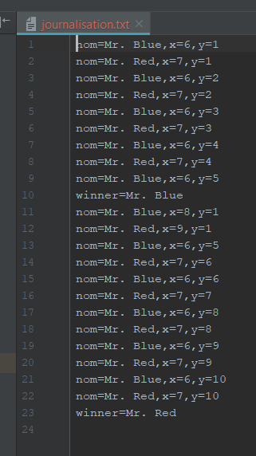

# uqac-poa-gomoku

<h2>8INF957 Programmation objet avancée - Hivers 2018 - UQAC</h2>
<h3>Devoir 3</h3>

<b>David Delemotte, Rénald Morice</b>

---

Pour ce travail, nous avons utilisé AspectJ. Il faut compiler le projet avec ajc (compilateur d'AspectJ) au lieu de javac pour que les aspects fonctionnent. Tutoriel pour configurer IntelliJ: https://www.jetbrains.com/help/idea/aspectj.html

---

<h4>Ce qui a été réalisé</h4>

- [x] Le code fourni n'a pas été modifié
- [x] **`aspects/Journalisation.aj`** Enregistre dans un fichier (journalisation.txt) les coups joué et le résultat final 
- [x] **`aspects/AdversaireJ.aj`** Implémente le multijoueur. Pour cela, deux joueur + une variable joueurCourant sont crées dans l'aspect. On change à chaque tour le joueur retourné par <i>getCurrentPlayer</i>
- [x] **`aspects/FinJeu.aj`** Empéche de jouer une fois la partie terminée et affiche le gagnant dans une jolie fenêtre.
- [x] **`aspects/ColorisationSuiteGagnante.aj`** Colore la suite gagnante en vert. Pour cela, on avait plusieurs solutions mais on a choisi de d'utiliser la rélexivité dans notre aspect, un concept intéressant en Java qui nous à permis d'accéder à des attributs et des méthodes normalement privés.

---

<h4>Images du résultat</h4>

  

  

  

